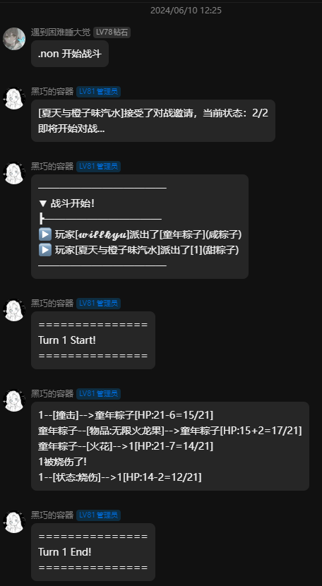
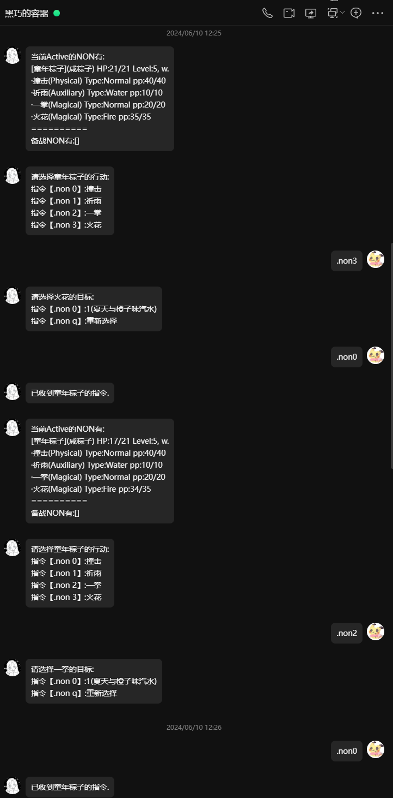

# Readme

## About this plugin

This is a game plugin for [OlivOS](https://github.com/OlivOS-Team/OlivOS) (which is a bot framework for the biggest chat platform Tencent QQ in China), still under developing.

This plugin allows users to play games like Pokemon battles (in this plugin we call them NONs rather than Pokemons). You should make your own database, for example, creating your own NONs, moves, abilities and so on.

Now it supports single battle and doubles as well.

## How to create your own database

You can find a `readme.md` document in `plugin/sim/data/` and that's the guide on creating your own database.

## Examples

The two screenshoots below show an example for this plugin.

# TODO

- [x] Add PP.
- [ ] Add types.
- [ ] Add new NONs, moves, abilities, items and so on.
- [ ] Pve maybe.

